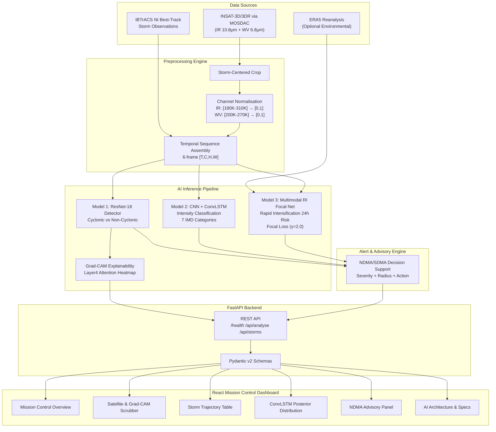

# CycloVision — System Architecture

## Mermaid Architecture Diagram

---

## Model Specifications

### Model 1: CycloneDetector (ResNet-18)

| Parameter | Value |
|---|---|
| Architecture | ResNet-18 (channel-adapted, 2-channel input) |
| Input Shape | `[B, 2, 128, 128]` (IR + WV per frame) |
| Output | 2-class logits (Non-Cyclonic, Cyclonic) |
| Grad-CAM Target Layer | `layer4` |
| Evaluation Accuracy | 100% (demo synthetic dataset) |
| Loss | CrossEntropyLoss |
| Optimiser | AdamW (lr=3e-4, wd=1e-4) |

### Model 2: CycloneIntensityModel (CNN + ConvLSTM)

| Parameter | Value |
|---|---|
| Architecture | Spatial CNN Encoder → ConvLSTM Cell → Temporal Aggregation |
| Input Shape | `[B, 6, 2, 128, 128]` (6-frame sequence × 2 channels) |
| Spatial Features | 64-channel CNN feature maps |
| ConvLSTM Hidden | 64 channels |
| Output | 7-class IMD intensity logits |
| Intensity Classes | Depression → Deep Depression → Cyclonic Storm → Severe → Very Severe → Extremely Severe → Super |
| Best Val Accuracy | 82.1% (demo synthetic dataset) |

### Model 3: RapidIntensificationModel (Multimodal)

| Parameter | Value |
|---|---|
| Architecture | ConvLSTM visual branch + Tabular FC branch → Fusion Classifier |
| Visual Input | `[B, 6, 2, 128, 128]` (same as intensity model) |
| Tabular Input | `[B, 4]` (wind_kt, 12h_trend, lat, pressure_norm) |
| Output | Single logit → sigmoid → RI probability |
| RI Definition | ≥ 30 knots sustained wind speed increase within 24 hours |
| Loss Function | Focal Loss (alpha=0.75, gamma=2.0) |
| Imbalance Ratio | ~7-10% positive RI events |
| Best Val Focal Loss | 0.0108 |

### Explainability: Grad-CAM

| Parameter | Value |
|---|---|
| Method | Gradient-weighted Class Activation Mapping (Grad-CAM) |
| Target Layer | `CycloneDetector.layer4` (spatial resolution 4×4 to 8×8) |
| Output | 128×128 normalised heatmap overlaid on IR channel |
| Interpretation | "Regions that most influenced the model prediction" |
| False Claim Prevention | Grad-CAM shows correlation, NOT causality |

---

## Technology Stack

| Layer | Technology |
|---|---|
| Deep Learning | PyTorch 2.5.1+cu121 (CUDA 12.1) |
| Backbone | torchvision ResNet-18 (adapted) |
| Backend | FastAPI 0.110+ with Pydantic v2 |
| Frontend | React 18 + Vite 5 + Tailwind CSS v4 |
| Charts | Recharts (AreaChart, LineChart) |
| Maps | Leaflet / react-leaflet (OpenStreetMap) |
| Icons | Lucide React |
| Data | IBTrACS NI Basin, MOSDAC INSAT-3D/3DR |
| Explainability | Grad-CAM (PyTorch hooks) |
| Packaging | uv + Node.js v20 |

---

## CORS and Development Configuration

- React dev server: `http://localhost:5173`
- FastAPI backend: `http://localhost:8000`
- CORS: Open for development (all origins allowed)
- For production: restrict CORS to specific frontend domain